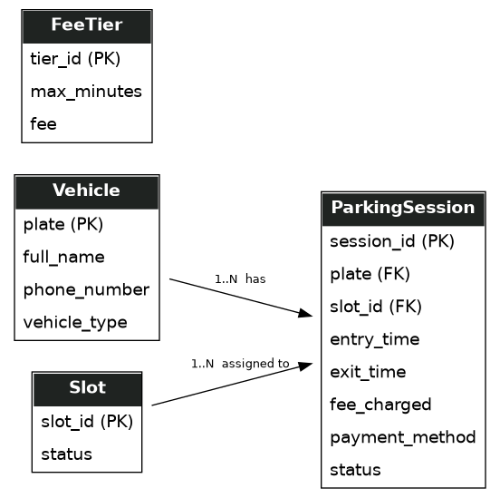

# Task One — Part (c): Dynamic Database Design

The database is SQLite (`parking.db`), created and migrated by
`database.py`. "Dynamic" here means the schema reflects live, changing
state — slots filling and emptying, sessions opening and closing — rather
than a static, one-time dataset, and pricing is data-driven rather than
hardcoded.

## Entity-Relationship Diagram

## Tables

### Slot
| Column | Type | Notes |
|---|---|---|
| slot_id | INTEGER PK | |
| status | TEXT | `FREE` or `OCCUPIED` |

### Vehicle
| Column | Type | Notes |
|---|---|---|
| plate | TEXT PK | Normalized (uppercase, no spaces) before storage |
| full_name | TEXT | |
| phone_number | TEXT | |
| vehicle_type | TEXT | e.g. Car, SUV, Motorcycle, or a custom value |
| email | TEXT | Present in the schema for backward compatibility; no longer collected or used |

### ParkingSession
| Column | Type | Notes |
|---|---|---|
| session_id | INTEGER PK, autoincrement | |
| plate | TEXT, FK → Vehicle.plate | |
| slot_id | INTEGER, FK → Slot.slot_id | |
| entry_time | TEXT (ISO timestamp) | |
| exit_time | TEXT (ISO timestamp) | NULL while the vehicle is still parked |
| fee_charged | REAL | Filled in on exit |
| payment_method | TEXT | `mpesa`, `card`, or `cash` |
| status | TEXT | `ACTIVE` or `COMPLETED` |

### FeeTier
| Column | Type | Notes |
|---|---|---|
| tier_id | INTEGER PK | |
| max_minutes | INTEGER | Upper bound of this bracket |
| fee | REAL | Charged for any stay up to `max_minutes` |

## Relationships

- **Vehicle → ParkingSession**: one-to-many. A plate can have many sessions
  over time (repeat visits), but each session belongs to exactly one
  vehicle.
- **Slot → ParkingSession**: one-to-many. A slot is reused across many
  sessions over its lifetime, but a session is assigned to exactly one
  slot.
- **FeeTier** is not linked to any other table — it's a standalone lookup
  table read by the Fee Calculation Module.

## Why this design is "dynamic"

- **Live state, not a snapshot:** `Slot.status` and `ParkingSession.status`
  change in real time as vehicles arrive and leave — the homepage's slot
  grid reads this state directly, so it's always current.
- **History is preserved, not overwritten:** completing a session doesn't
  delete it — `status` flips to `COMPLETED` and `exit_time`/`fee_charged`
  are filled in, so every visit remains queryable (the History page, and
  the revenue total on Admin).
- **Pricing is data, not code:** `FeeTier` rows are what `calculateFee()`
  reads. Changing a price is a row update via **Admin → Edit rates**, never
  a code change or deployment — directly satisfying the client's
  requirement to let management change rates at any time.
- **Migrations, not manual fixes:** `database.py` checks for missing
  columns (`payment_method`, `vehicle_type`) on startup and adds them via
  `ALTER TABLE` if absent, so the schema can evolve without wiping existing
  data.

## Design decisions worth noting

- **Plate normalization** (uppercase, spaces stripped) happens before any
  write, so `"KAA 123A"`, `"kaa123a"`, and `"KAA123A"` are always treated as
  the same vehicle — this is enforced in code, not the database schema.
- **No waiting-queue table** in the current design — see
  `02_data_structures.md` for the reasoning; entry is declined outright
  when the lot is full.
- **`email` column retained but unused** — removed from the entry form and
  replaced with `vehicle_type`, but the column was left in place rather
  than dropped, to avoid a destructive schema change for anyone with an
  existing database.
